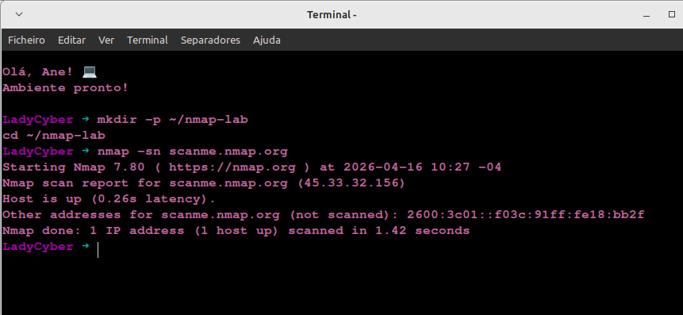
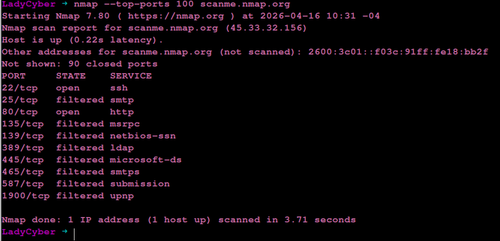
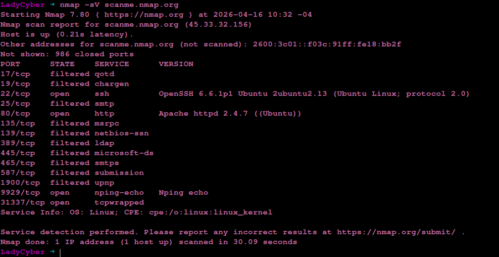
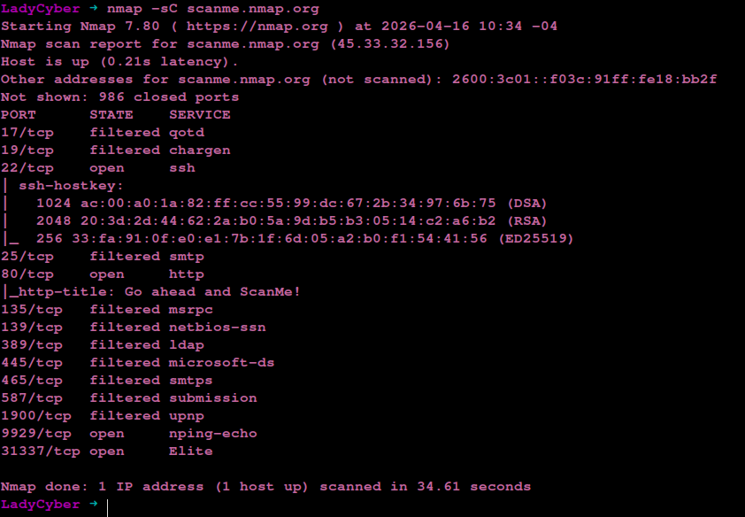
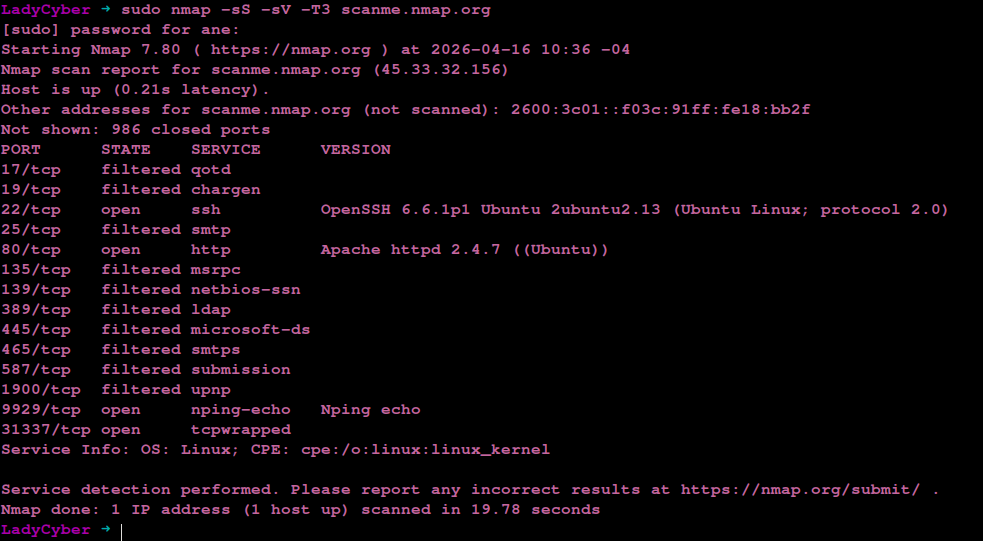
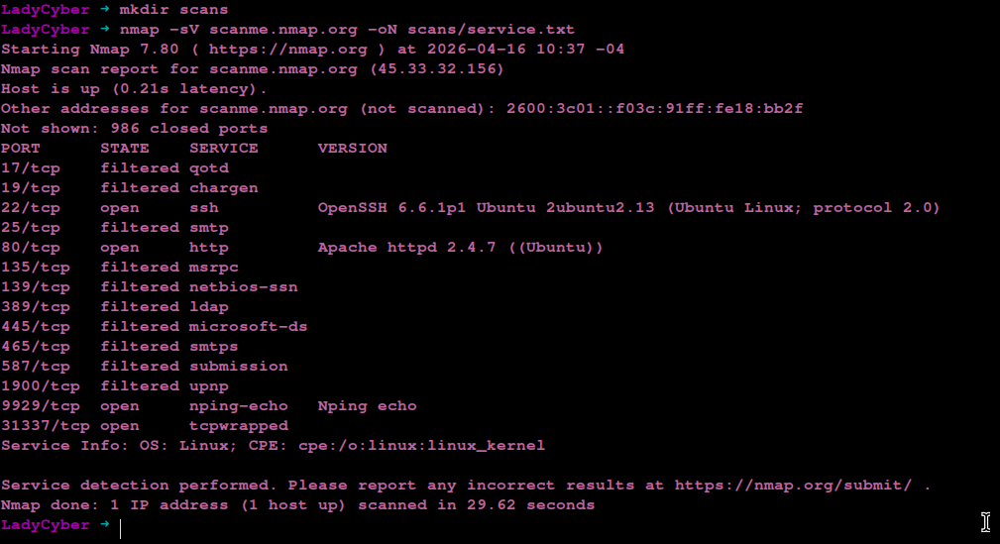
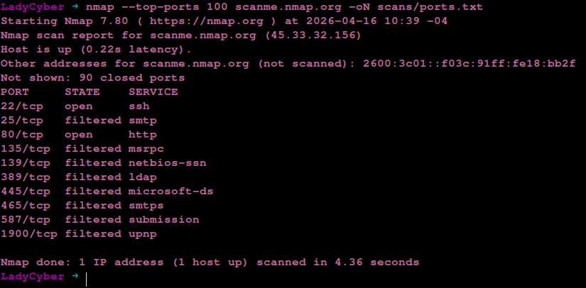
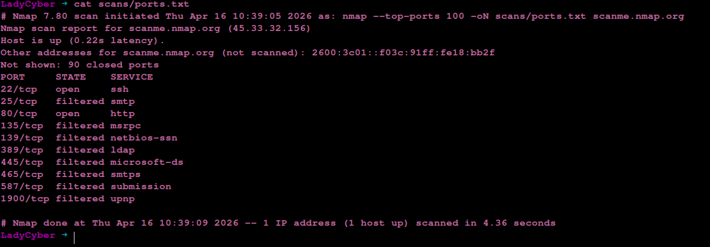
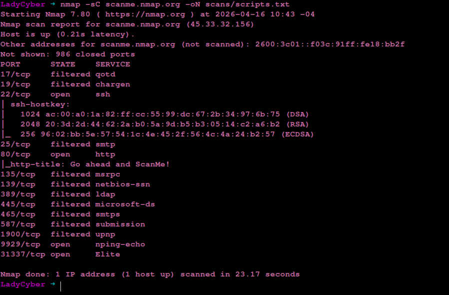
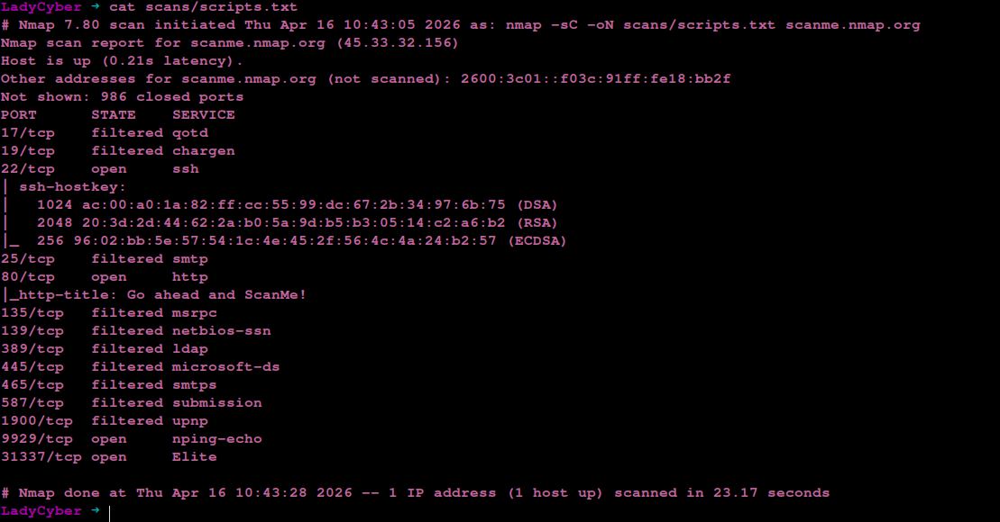

# 🔍 Nmap Network Recon Lab

Projeto prático de reconhecimento de rede utilizando Nmap, com foco em identificação de serviços, portas abertas e análise de superfície de ataque.

## 🎯 Objetivo
Demonstrar habilidades em:
- Host Discovery
- Port Scanning
- Service Enumeration
- NSE Scripts
- Análise de exposição de serviços

## ⚙️ Ambiente
- Linux Mint
- Intel Celeron
- 4GB RAM
- Sem uso de máquina virtual

## 🛠️ Ferramentas
- Nmap

## 📊 Técnicas utilizadas

### Descoberta de host
nmap -sn scanme.nmap.org

### Varredura de portas
nmap --top-ports 100 scanme.nmap.org

### Detecção de serviços
nmap -sV scanme.nmap.org

### Scripts NSE
nmap -sC scanme.nmap.org

### Scan avançado
sudo nmap -sS -sV -T3 scanme.nmap.org

## 📌 Resultados

- Porta 22 (SSH) aberta
- Porta 80 (HTTP) aberta
- Portas filtradas indicando firewall
- Sistema identificado como Linux

## 🔐 Análise

O alvo apresenta serviços expostos que podem representar risco se não estiverem protegidos. A presença de portas filtradas indica controle de acesso na rede.

## ⚠️ Observação

Projeto realizado em ambiente autorizado (scanme.nmap.org).

## 👩‍💻 Autora
Leidiane Macedo
## 📸 Evidências

### Host Discovery

### Port Scan

### Service Detection

### NSE Scripts

### Full Scan

### Execuções adicionais

